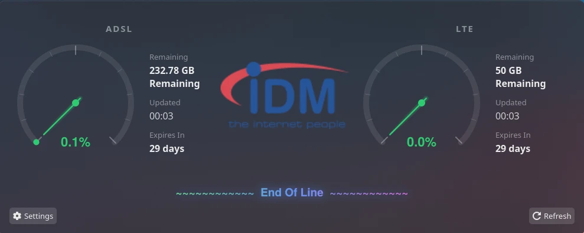

# IDM Quota Monitor

KDE Plasma 6 panel widget showing IDM internet quota usage for ADSL and LTE connections.



## Features

- Slim panel bar showing connection type, usage bar, and percentage
- Click the **ADSL / LTE badge** to toggle which connection is shown on the panel
- Click anywhere else to open the popup with:
  - Arc gauge + GB remaining + last-updated time
  - 24h usage history line chart
- Color-coded: green < 70% → orange 70–90% → red ≥ 90%
- Systemd user timer refreshes every 15 minutes

## Requirements

- KDE Plasma 6.x
- `python-requests` (installed automatically by `install.sh`)
- `plasma5support`

## Install

```bash
chmod +x install.sh
./install.sh
```

Then:
1. Restart plasmashell: `kquitapp6 plasmashell; plasmashell &`
2. Right-click panel → **Add Widgets** → search **IDM Quota**
3. Right-click widget → **Configure** → enter your IDM username and password

## Credentials

Credentials are entered via **right-click → Configure** and stored in:

```
~/.config/IDMQuota/config.conf
```

You can also edit that file directly:

```
username=your_idm_username
password=your_idm_password
```

## File structure

```
.
├── install.sh
├── README.md
└── idm-quota-monitor/
    ├── metadata.json
    ├── fetch_quota.py          # login + scrape both connections → JSON stdout
    ├── idm-quota.service       # systemd oneshot unit
    ├── idm-quota.timer         # fires every 15 minutes
    └── contents/
        ├── config/
        │   ├── config.qml      # config page declaration
        │   └── main.xml        # config schema
        ├── images/
        │   └── logo.png
        └── ui/
            ├── main.qml        # panel bar + popup
            ├── ConnectionTab.qml  # per-connection tab (gauge + chart)
            └── configGeneral.qml  # credentials + connection config page
```

## Manual refresh

Click the widget → **Refresh**, or:

```bash
systemctl --user start idm-quota.service
```

## Logs

```bash
journalctl --user -u idm-quota.service -n 20
```
