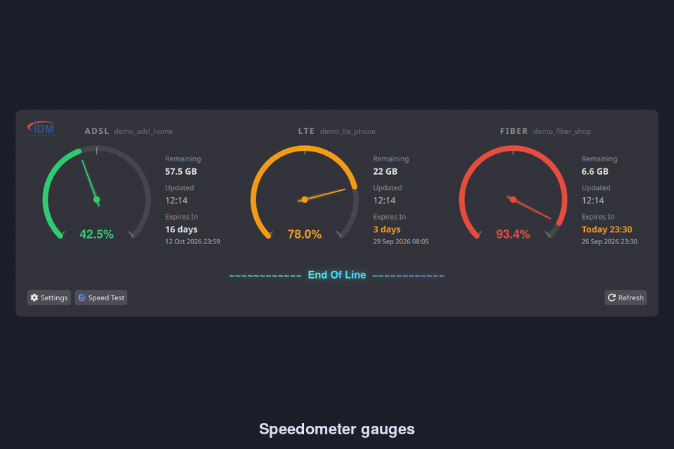

# IDM Quota Monitor

A KDE Plasma 6 panel widget, with a Windows tray app version, that shows the internet quota of your IDM services. It detects every ADSL/VDSL, LTE and Fiber service on your IDM login and shows the usage, remaining quota, last update and exact expiry date and time of up to three of them at once. Services can be renamed, and the usage gauge comes in two styles (Speedometer or Simple). A built-in speed test measures download and upload separately.



## Install on Linux

Requires KDE Plasma 6 and Python 3. The installer adds `python-requests` and `python-cryptography` (pacman, apt or dnf, with a pip fallback).

```bash
git clone https://github.com/DarkXero-dev/idm-kde-plasmoid
cd idm-kde-plasmoid
chmod +x install.sh
./install.sh
```

Then:

1. Restart Plasma: `kquitapp6 plasmashell; plasmashell &`
2. Right-click the panel, choose **Add Widgets** and search for **IDM Quota**.
3. Right-click the widget, choose **Configure**, enter your IDM login and click **Detect services**.
4. Tick up to 3 services to show, optionally rename them, and pick a gauge style.

## Install on Windows

Works on Windows 7 SP1 and newer. The `.exe` is built automatically by GitHub, so there is nothing to build or install.

1. Download `IDMQuotaMonitor.exe` from the [latest release](https://github.com/DarkXero-dev/idm-kde-plasmoid/releases/latest).
2. Run it from anywhere. It lives in the system tray: click the icon to switch service and right-click it for the menu.
3. Open **Settings**, enter your IDM login, click **Detect services** and pick what to show.

## License

GPL-3.0-or-later. See [LICENSE](LICENSE).
